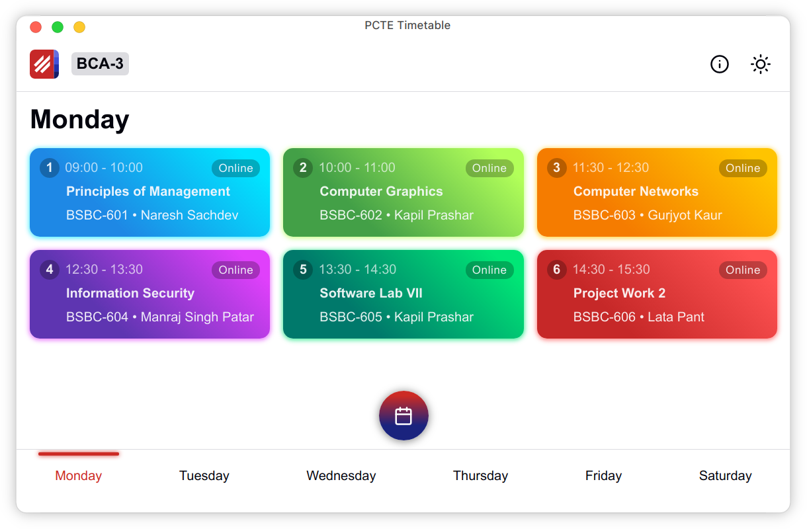

<p align="center">
  
</p>

<h1 align="center">PCTE Timetable</h1>

<p align="center">Keep track of PCTE college time table.</p>

<p align="center">
  
</p>

## Features

- Easy to navigate by swiping
- Show the lectures of today
- Overview of all the lectures in a day
- See info about faculties and subjects
- Add to home screen
- Works offline
- Dark mode support
- Convert PDF to Excel
- Convert Excel to JSON
- Admin area to manage the resources

## Stack

- React `16.x`
- SASS `4.x`
- node-xlsx `0.x`
- Mongoose `5.x`

## Requirements

- Node.js `14.x`
- Vercel CLI `21.x`
- Python `3.7`

## Setup

1. Install Node.js dependencies:

```sh
yarn
```

2. Install the Vercel CLI globally:

```sh
npm install -g vercel
```

3. Create a MongoDB database. You can host it yourself or use [MongoDB Atlas](https://docs.atlas.mongodb.com/getting-started/).

4. Copy the connection string. (e.g. `mongodb+srv://<username>:<password>@clustername.mongodb.net/dbname`)

5. Add this environment variable with the connection string in the `.env` file.

```sh
MONGODB_URI=
```

## Development

### Start the local development server

> NOTE: This requires a Vercel account.

```sh
vercel dev
```

## Deployment

> NOTE: This project is hosted on [Vercel](https://vercel.com).

1. Put this repository on GitHub or any other supported Git provider.
2. Create a [new project](https://vercel.com/new) on Vercel.
3. Connect the repository to the project.
4. Add the following [environment variables](https://vercel.com/docs/environment-variables):

| Variable                | Description                                             |
| ----------------------- | ------------------------------------------------------- |
| `PUBLIC_URL`            | Domain of the project (e.g. https://example.vercel.app) |
| `MONGODB_URI`           | Connection string of the database                       |
| `REACT_APP_TRACKING_ID` | Google Analytics tracking ID (optional)                 |
