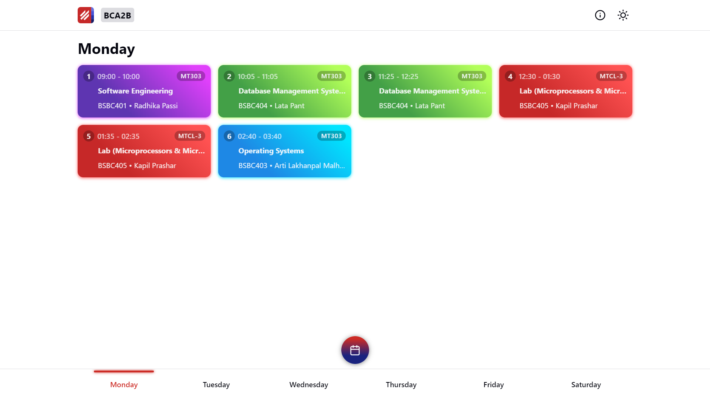

<p align="center">
  
</p>

<h1 align="center">PCTE Timetable</h1>

<p align="center">Keep track of PCTE college time table.</p>

<p align="center">
  
</p>

## Features

- Easy to navigate by swiping
- Overview of all the lectures in a day
- Show the lectures of today
- See info about faculties and subjects
- Create shortcut as PWA
- Works offline
- Dark mode support
- Convert PDF to Excel
- Convert Excel to JSON

## Stack

- React `16.x`
- SASS `4.x`
- node-xlsx `0.x`

## Requirements

- Node.js `12.x`
- Python `3.7`

## Setup

1. Install Node.js dependencies:

```sh
yarn
```

2. Convert Excel to JSON:

```sh
npm run export-json
```

3. Import data in client:

```sh
npm run import-data-in-client
```

## Development

```sh
yarn start
```

## Deployment

```sh
yarn build
```
